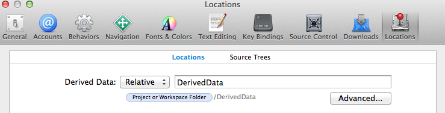
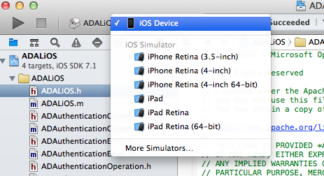
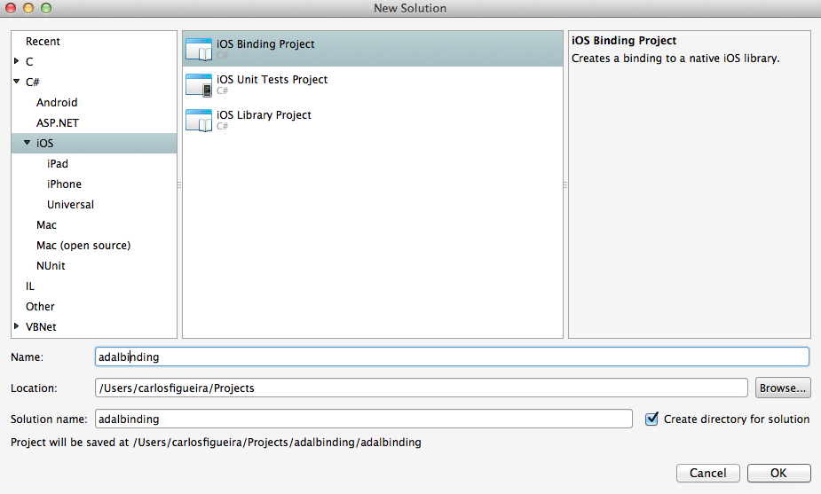
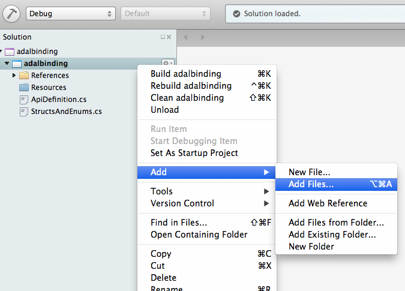

---
services:
platforms:
author: azure
---

# Using ADAL for Objective-C in Xamarin using bindings

This sample shows how to build a Xamarin binding to our native ADAL for iOS library. This is a sample and is not to be used in production. For those interested in binding to our iOS library in .Net using Xamarin, this code is a good guide and will build a bindling.dll file for your Xamarin for iOS project for use with Xamarin.

## Quick Start

### Requirements

To build this sample you'll need a Mac machine with the following tools

- Xamarin Studio: You can get [Xamarin Studio](http://xamarin.com/studio?_bt=44014804148&_bk=xamarin%20studio&_bm=e&gclid=COqr3sHrs70CFUWVfgodkmEAwg) from the Xamarin website
- Xcode: you can get it via the App Store

To use the binding DLL created by the sample you can either use Xamarin Studio, or Visual Studio 2013 with the Xamarin tooling installed.

### Learn about binding objective-c libraries with Xamarin

This document will guide you through building the binding library, but you'll get up to speed faster if you do some reading of the Xamarin documentation for iOS Binding to native libraries located here: [Binding Objective-C Libraries](http://docs.xamarin.com/guides/ios/advanced_topics/binding_objective-c/binding_objc_libs/)

You may also want to read through how Xamarin works with Objective-C here: [Xamarin for Objective-C Developers](http://docs.xamarin.com/guides/ios/advanced_topics/xamarin_for_objc/)

### Building the native library for iOS

Start by downloading the [Azure Active Directory Authentication Library (ADAL) for iOS](https://github.com/MSOpenTech/azure-activedirectory-library-for-ios). Since it's a GitHub repository, you can either use the "Download ZIP" button or simply clone the repository locally. Once it's in the local machine, open the workspace in Xcode.

Before building the library, let's find out where the compiled library files will be located. Open the Xcode preferences menu, and select the "Locations" option, which will show where the "Derived Data" is built. For this walkthrough, I'll assume that the value is as shown below (Relative), which means that the library will be "binplaced" under the workspace folder (if you know what you're doing and has some other value, I'll assume that you'll know where to find the library files in the next steps).

Now build the library in two flavors: ARM and i386. If the current platform is the "iOS Device" (or the name of a device that is connected to the Mac), then you'll be building for ARM. If the current platform is one of the the iOS Simulators, then it will build for i386. Press Command+B to build for the current platform. Then, select a different platform (if the selected platform was a simulator, choose an iOS Device; if the device, choose any simulator - see image below) and build it again.

You now should have two files called libADALiOS.a in your computer. It's time to go to the command line (terminal) to combine those two libraries into a "fat" or "universal" library, as described in [Xamarin docs for linking native libraries](http://docs.xamarin.com/guides/ios/advanced_topics/native_interop/). We want to do that so that we'll be able to use the DLL on both the simulators (for easy testing) and on real devices (for production).

On the terminal, go to the directory where you saved the workspace, then go to ./DerivedData/ADALiOS/Build/Products. Under that directory there will be two subdirectories: Debug-iphoneos and Debug-iphonesimulator (or Release-iphoneXXX, depending on how you built your library). Under each of those folders you'll find the .a file which has the library binaries. We'll now use the "lipo" tool to combine the two libraries into one:

    carloss-mac:Products carlosfigueira$ pwd
    /Users/carlos/Documents/github/MSOpenTech/azure-activedirectory-library-for-ios/DerivedData/ADALiOS/Build/Products
    carloss-mac:Products carlosfigueira$ \
    > lipo -create \
    > Debug-iphoneos/libADALiOS.a \
    > Debug-iphonesimulator/libADALiOS.a \
    > -o libADALiOS-universal.a
    carloss-mac:Products carlosfigueira$ lipo -info libADALiOS-universal.a
    Architectures in the fat file: libADALiOS-universal.a are: armv7 armv7s i386 arm64
    
    carloss-mac:Products carlosfigueira$ 

And the native part is done.

### Creating the iOS Binding Project

With the native world out of the way, it's time to create the wrapper managed DLL over that library. Open Xamarin Studio and create a new project, of type "iOS Binding Project"

Now add the "fat" library which we just created to the project: right-click (or use the secondary gesture on the trackpad) the project, then select "Add --> Add Files"

Navigate to the location where the "fat" library was created above, and select it.

The project contains two files: ApiDefinitions.cs and StructsAndEnums.cs. Those files will provide the description for the native interfaces using CLR types. Open the files with the same names located in the root of this repository and copy the contents of the files to the ones in your project.

You can now build the project. The generated DLL will be at <projectFolder>/bin/[Debug/Release], depending on which configuration you're using. Notice that the debug and release versions of the DLL are practically the same, as they're mostly a very thin shim over the native library.

### Run and use!

At this point you can copy the generated DLL and add it as a reference to a Xamarin iOS application, either in Xamarin Studio or in Visual Studio (with the Xamarin tooling installed)
